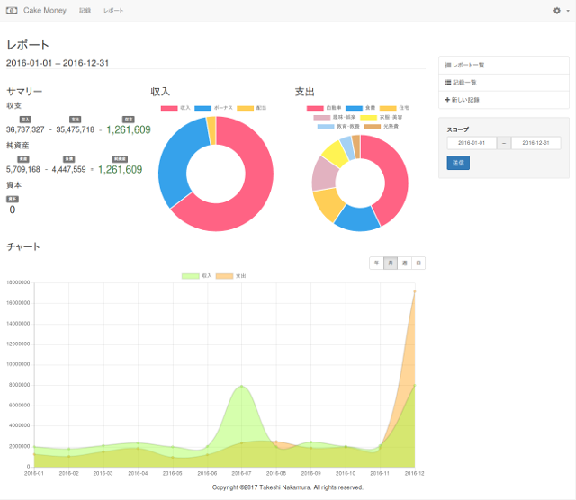

*Read this in other languages: [English](README.md)*

# CakeMoney

CakeMoneyはCakePHP 3で作られたシンプルな家計簿です。(妻のために作りました。)

複式簿記の考え方が取り入れられています。
(素人なので、何かが間違っているかもしれません。)




* [Dashboard](webroot/img/screenshots/dashboard-l-ja.png)
* [Report](webroot/img/screenshots/report-l-ja.png)
* [Dashboard on mobile](webroot/img/screenshots/dashboard-s-ja.png)
* [Report on mobile](webroot/img/screenshots/report-s-ja.png)

## 要件

* PHP 5.6以上
* MySQL または PostgreSQL

詳細はCakePHPの
[ドキュメント](https://book.cakephp.org/3.0/ja/installation.html)
をご覧ください。

CakeMoney はCDN経由で以下を参照します。
* Font Awesome
* Twitter Bootstrap
* Bootstrap Datepicker
* Chart.js

## インストール

### CakeMoney

1. [Composer](http://getcomposer.org/doc/00-intro.md)
をダウンロードまたはインストールしてください。
2. CakeMoneyをクローンまたはコピーしてください。
3. CakeMoneyのディレクトリに移動して、
`composer install` を実行して、必要なファイルをインストールしてください。
```bash
cd /var/www/html/cakemoney
php composer.phar install
```

### データベース

1. CakeMoney用のデータベースを用意してください。
2. `config/app.default.php` をコピーして `config/app.php` を作成してください。
3. 以下のコマンドを実行して、データベースのテーブルを作成します。
```bash
./bin/cake migrations migrate
```

### Webサーバ

Apache, mod_rewriteなど、Webサーバを設定してください。
CakePHPの [ドキュメント](https://book.cakephp.org/3.0/ja/installation.html#url-rewriting)
を参考にしましょう。

## 使い方

### カテゴリの設定

まずはカテゴリを追加してください。
ナビゲーションバーにある歯車をクリックして「カテゴリ」ページを開き、
右側の「新しいカテゴリ」をクリックします。

以下のカテゴリを追加しましょう。

| 名前       | 科目 |
|------------|------|
| 給料       | 収入 |
| 現金       | 資産 |
| 食費       | 支出 |
| 衣服・美容 | 支出 |
| ...        | ...  |

### 記録

お金のやりとりが発生したら、
「記録」ページの右側にある「新しい記録」をクリックして、データを入力します。

### レポート

まとめが知りたくなったら、「レポート」ページを開いてください。

## ライセンス

[MIT](LICENSE)

## 作者

なかむら たけし
