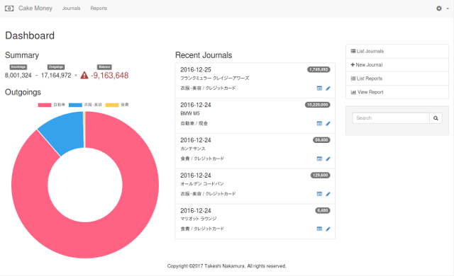
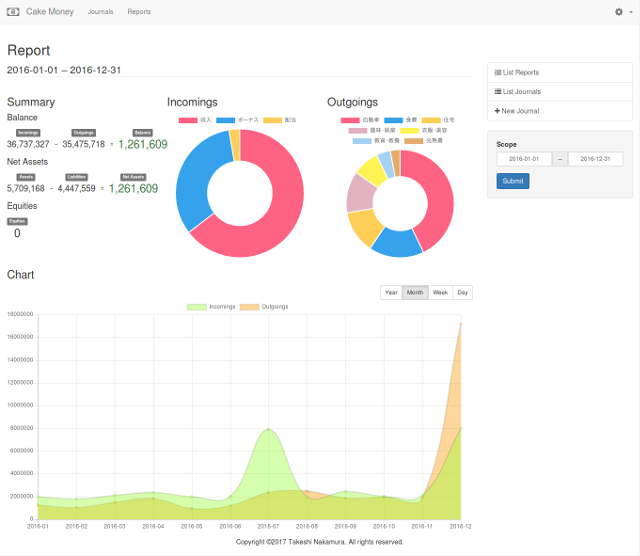

*Read this in other languages: [日本語](README.ja.md)*

# CakeMoney

CakeMoney is a simple household account book (for my wife).
This application is implemented by CakePHP 3.

The way of booking is based on double-entry bookkeeping system.





* [Dashboard](webroot/img/screenshots/dashboard-l-en.png)
* [Report](webroot/img/screenshots/report-l-en.png)
* [Dashboard on mobile](webroot/img/screenshots/dashboard-s-en.png)
* [Report on mobile](webroot/img/screenshots/report-s-en.png)

## Requirements

* PHP 5.6 or later
* MySQL or PostgreSQL

For more detail, see CakePHP
[Document](https://book.cakephp.org/3.0/en/installation.html).

CakeMoney refers via CDN:
* Font Awesome
* Twitter Bootstrap
* Bootstrap Datepicker
* Chart.js

## Installation

### CakeMoney

1. Download or install [Composer](http://getcomposer.org/doc/00-intro.md).
2. Clone or copy files of CakeMoney.
3. Change directory to CakeMoney directory and
execute `composer install` to install necessary libraries.
```bash
cd /var/www/html/cakemoney
php composer.phar install
```

### Database

1. Create database for CakeMoney.
2. Create `config/app.php` and set suitable values in
`Datasources.default` array.
3. Create database tables by executing the following:
```bash
./bin/cake migrations migrate
```

### Web server

Configure web server. (e.g. Apache and mod_rewrite)
See CakePHP [Docuemnt](https://book.cakephp.org/3.0/en/installation.html#url-rewriting).

## Usage

### Category setting

First, add categories.
Open "Categories" page from navigation bar and click "New Category" on the
right side of the page.

Add categories as the following:

| Name           | Account |
|----------------|---------|
| Salary         | Income  |
| Cash           | Asset   |
| Foods          | Expense |
| Clothes/Beauty | Expense |
| ...            | ...     |

### Journal

In order to book giving and taking of money,
open "New Journal" on the right side of "Journals" page.

### Report

If you want to know the summary, open "Reports" page.

## License

[MIT](LICENSE)

## Author

Takeshi Nakamura
